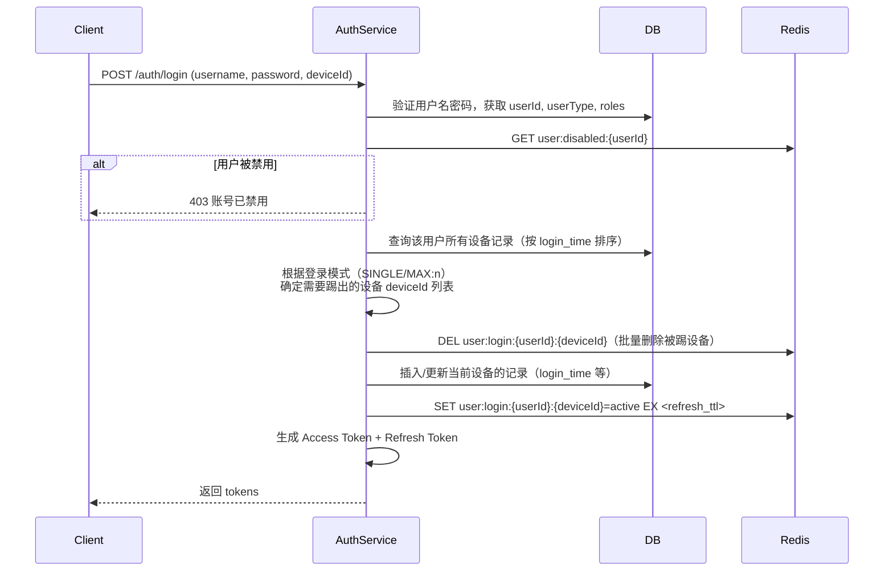

## 登录与会话管理需求与技术方案

### 一、业务需求

1. **登录模式可配置**  
   - 支持三种模式：`MULTI`（无限制多端登录）、`SINGLE`（唯一登录，新登录踢旧登录）、`MAX:n`（最多同时登录 n 端，如 `MAX:3`）。  
   - 模式可全局配置（Nacos），也支持按用户级别覆盖（数据库）。

2. **设备识别与管理**  
   - 每个客户端拥有唯一设备标识 `deviceId`（前端生成 UUID 并持久化，通过 `X-Device-Id` 头传递）。  
   - 用户可查询自己已登录的设备列表（含设备信息、登录时间、最后活跃时间）。  
   - 用户可主动踢出指定设备（使其立即下线）。

3. **强制下线与禁用**  
   - 管理员可禁用用户，禁用后该用户所有在线设备立即强制下线，且无法登录。  
   - 用户修改密码后可选择踢出所有设备。

4. **安全与性能**  
   - Access Token 短时效（15分钟），Refresh Token 长时效（30天）。  
   - 网关无状态，不依赖 Redis 存储 session，仅做签名验证和两次 Redis 状态检查。  
   - 登录操作为低频操作，无需复杂的原子性控制（如 Lua 脚本或分布式锁）。

---

### 二、技术方案

#### 2.1 设备标识 `deviceId` 的生成与传递

- **生成**：客户端首次访问时生成一个 UUID，存入 `localStorage`。  
- **传递**：每次 HTTP 请求在请求头 `X-Device-Id` 中携带。  
- **兜底**：若请求头缺失，网关或 `auth-service` 自动生成一个 UUID 并通过响应头 `Set-Device-Id` 返回，客户端需保存并在后续请求中携带。

#### 2.2 Token 设计（均为 JWT）

| Token 类型    | Payload 内容                                                 | 有效期            | 存储位置                                 |
| ------------- | ------------------------------------------------------------ | ----------------- | ---------------------------------------- |
| Access Token  | `userId`, `userName`, `userType`, `roleList`, `deviceId`, `exp` | 15 分钟（可配置） | 客户端（内存或 sessionStorage）          |
| Refresh Token | `userId`, `deviceId`, `type="refresh"`, `exp`                | 30 天（可配置）   | 客户端（localStorage 或 sessionStorage） |

> 注：Refresh Token 为无状态 JWT，服务端不存储，仅验签和校验有效期。

#### 2.3 Redis 数据结构（仅两个 key）

| Key 模式                         | 类型   | 说明                              | TTL                                  |
| -------------------------------- | ------ | --------------------------------- | ------------------------------------ |
| `user:disabled:{userId}`         | String | 存在表示用户被禁用，值为禁用原因  | 长期（管理员解除禁用时删除）         |
| `user:login:{userId}:{deviceId}` | String | 标记设备在线状态，值为 `"active"` | **Refresh Token 有效期**（如 30 天） |

> **无其他 Redis 数据**。设备列表、设备详细信息存储在 MySQL 中。

#### 2.4 数据库表设计（设备管理）

```sql
CREATE TABLE `user_device` (
  `id` bigint PRIMARY KEY AUTO_INCREMENT,
  `user_id` bigint NOT NULL,
  `device_id` varchar(64) NOT NULL COMMENT '客户端唯一标识',
  `device_name` varchar(100) COMMENT '设备名称（用户自定义或自动获取）',
  `os` varchar(50) COMMENT '操作系统',
  `browser` varchar(50) COMMENT '浏览器',
  `ip` varchar(45) COMMENT '登录IP',
  `user_agent` text COMMENT '原始User-Agent',
  `login_time` datetime NOT NULL COMMENT '本次登录时间',
  `status` tinyint DEFAULT 1 COMMENT '1-在线 0-已登出',
  `created_at` datetime,
  `updated_at` datetime,
  UNIQUE KEY `uk_user_device` (`user_id`, `device_id`)
);
```

> 每次登录时，若设备已存在则更新 `login_time`、`ip`、`user_agent` 等，否则插入新记录。

#### 2.5 登录流程（简化，无 Lua）



**说明**：
- 登录操作是低频的，因此不考虑竞态条件，允许极端情况下短暂超出设备限制。
- 被踢出的设备会立即失效，因为网关会检查 `user:login` key 是否存在。

#### 2.6 刷新 Token 流程

接口：`POST /auth/refresh`

- 客户端携带 **Refresh Token**（JWT）和当前 `deviceId`（Header）。
- 服务端：
  1. 验证 Refresh Token 签名、有效期。
  2. 从 Payload 提取 `userId` 和 `tokenDeviceId`，与请求头中的 `deviceId` 比对，不一致则拒绝。
  3. 检查 Redis：`GET user:disabled:{userId}` 是否存在（禁用则拒绝）。
  4. 检查 Redis：`GET user:login:{userId}:{deviceId}` 是否存在（设备被踢则拒绝）。
  5. 通过后，生成新的 Access Token（短时效），并**续期** Redis key：`EXPIRE user:login:{userId}:{deviceId} <refresh_ttl>`。
  6. （可选）生成新的 Refresh Token 并返回（滚动刷新）。若不滚动，则返回原 Refresh Token。
- 返回新 Access Token（及可选的新 Refresh Token）。

#### 2.7 网关处理

**职责**：
- 验证 Access Token 签名（共享密钥，本地计算）。
- 提取 `userId`, `deviceId`。
- **Redis Pipeline** 查询两个 key：
  - `user:disabled:{userId}`
  - `user:login:{userId}:{deviceId}`
- 若任一 key 不存在或值异常，返回 401。
- 将用户信息（`userId`, `userType`, `roleList`）通过请求头 `X-User-Id`, `X-User-Type`, `X-User-Roles` 转发给下游服务。

**性能优化**：
- 对 `user:disabled:{userId}` 可在网关本地缓存（Caffeine）5 秒，减少 Redis 查询。禁用变更时需广播清理缓存（演示项目可暂不实现）。

#### 2.8 设备管理接口

| 接口                      | 方法                         | 实现说明                                                     |
| ------------------------- | ---------------------------- | ------------------------------------------------------------ |
| `GET /auth/sessions`      | 获取当前用户所有在线设备列表 | 查询数据库 `user_device` 表，`status=1` 且 Redis 中 `user:login:{userId}:{deviceId}` 存在的设备 |
| `POST /auth/session/kick` | 踢出指定设备                 | 删除 Redis key `user:login:{userId}:{targetDeviceId}`，更新数据库设备状态为 0 |
| `POST /auth/logout`       | 退出当前设备                 | 删除 Redis key `user:login:{userId}:{deviceId}`，更新数据库当前设备状态为 0 |
| `POST /auth/logout-all`   | 退出所有设备                 | 遍历该用户所有设备，删除 Redis key，更新数据库状态为 0       |

> 设备详细信息（设备名、OS、浏览器等）可在首次登录时通过前端额外接口上报，或从 User-Agent 解析。

#### 2.9 后台管理接口

| 接口                           | 方法             | 说明                                                         | 权限    |
| ------------------------------ | ---------------- | ------------------------------------------------------------ | ------- |
| `POST /admin/user/disable`     | 禁用用户         | 设置 Redis `user:disabled:{userId}=原因`，并调用退出所有设备（删除 Redis key + 更新数据库） | `ADMIN` |
| `POST /admin/user/enable`      | 解除禁用         | 删除 Redis `user:disabled:{userId}`                          | `ADMIN` |
| `PUT /admin/config/login-mode` | 修改全局登录模式 | 更新 Nacos 配置或数据库，动态生效                            | `ADMIN` |

#### 2.10 登录模式配置

- **全局模式**：存储在 Nacos 配置中心，key = `security.login-mode.global`，值示例：`MULTI`、`SINGLE`、`MAX:3`。
- **用户级模式**：可扩展 `user` 表增加 `login_mode` 字段，优先级高于全局模式。
- **登录时读取**：`auth-service` 根据当前用户获取有效模式，决定踢出哪些设备。

#### 2.11 错误码定义

| 错误码 | 含义                                   |
| ------ | -------------------------------------- |
| 401001 | Token 无效或已过期                     |
| 401002 | 账号已被禁用                           |
| 401003 | 设备未登录或已被踢下线                 |
| 401004 | Refresh Token 无效或设备不匹配         |
| 403001 | 登录设备数量已达上限（由登录接口返回） |

---

### 三、部署与配置

#### 3.1 环境要求
- Nacos 2.4.0+
- Redis 7.2+
- MySQL 8.0+
- JDK 17+

#### 3.2 配置参数（application.yml）

```yaml
jwt:
  secret: your-jwt-secret-key
  access-token-ttl: 900          # 15分钟
  refresh-token-ttl: 2592000     # 30天

security:
  login-mode:
    global: MULTI                 # MULTI / SINGLE / MAX:3
  gateway:
    redis-pipeline: true
    cache-disabled-user-ttl: 5    # 网关本地缓存禁用标记的时间（秒）
```

#### 3.3 启动顺序
1. Nacos、Redis、MySQL
2. `auth-service`
3. 其他业务服务（product、seckill、order）
4. `gateway-service`

---

### 四、安全性说明

- **Access Token 短时效**：降低盗用风险。
- **Refresh Token 与设备绑定**：防止 Token 跨设备使用。
- **网关不存储任何状态**：水平扩展友好。
- **禁用用户实时生效**：通过 Redis 标记 + 网关检查。
- **退出登录实时生效**：删除 Redis 在线状态 key，立即拦截后续请求。

---

### 五、后续扩展

- **多实例缓存一致性**：禁用用户时通过 Redis Pub/Sub 或 RocketMQ 通知所有网关实例清理本地缓存。

---

### 六、总结

本方案在保证功能完整的前提下，极大简化了 Redis 存储和登录并发控制，完全符合演示项目的需求。核心特点：

- Redis 仅存两个 key（`user:disabled`、`user:login`）
- Refresh Token 无状态 JWT，服务端不存储
- 登录操作简单直接，不考虑竞态条件
- 网关只做签名验证和两次 Redis Pipeline 查询
- 设备管理基于 MySQL 表，支持设备列表、踢出、禁用等完整功能
